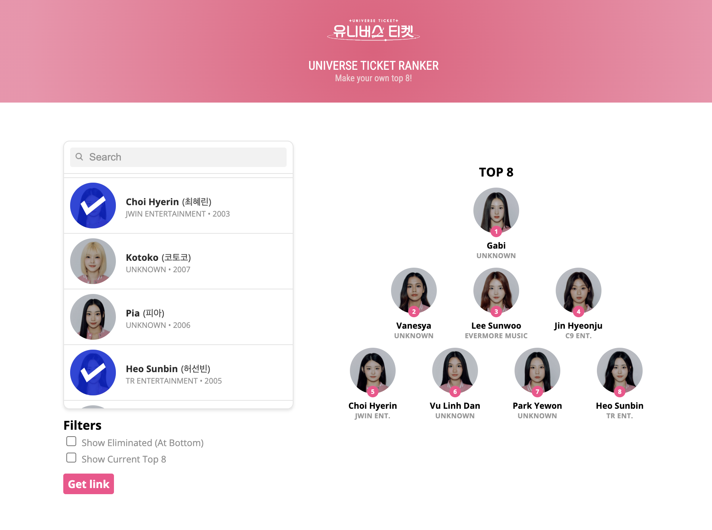

A personal ranker that allows you to rank and sort your own Top 8 for SBS's Korean-global idol survival show Universe Ticket. It currently has functionality for adding and removing trainees on the table through click, sorting them on the ranking itself through drag & drop, and activating filters that show which contestants have been eliminated or currently hold a top 8 position. It is also possible to save a link of your current ranking to revisit it as the episodes progress.

<b>Updates</b>
* 24/10: Ranker is live!
* 26/10: Removed grey background, added colors for 1st and 2nd half
* 30/10: Nationality is now showcased instead of company on contestants list
* 10/12: Finally updated to first elims and added top trainees
* 17/12: Updated to EP05 elims, added PRISM as classes, changed colors
* 22/12: Updated to EP06 elims, changed colors
* 02/01: Updated to EP07 elims, changed colors according to PRISM stage
* 25/01: Updated to final ranking

<b>WIP</b>
* Maybe make a mode for different stages of eliminations?
